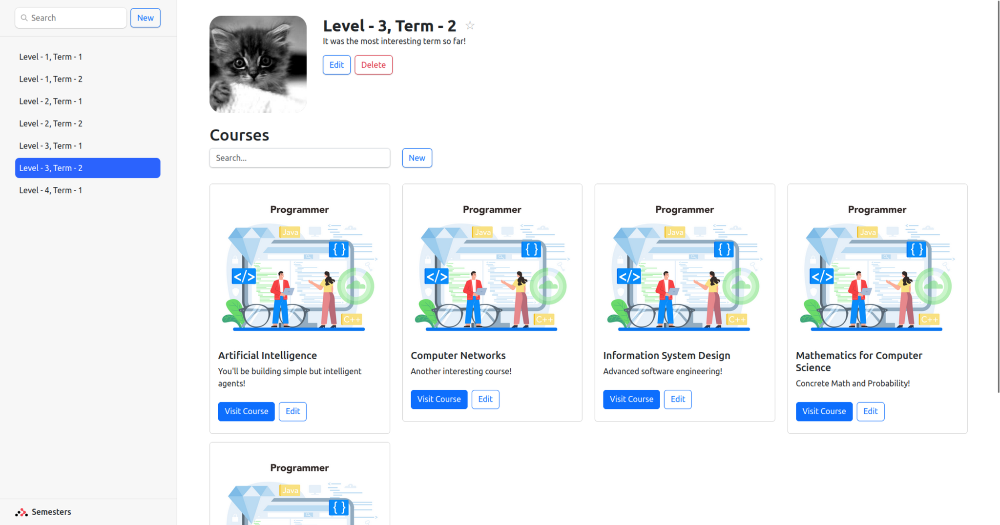
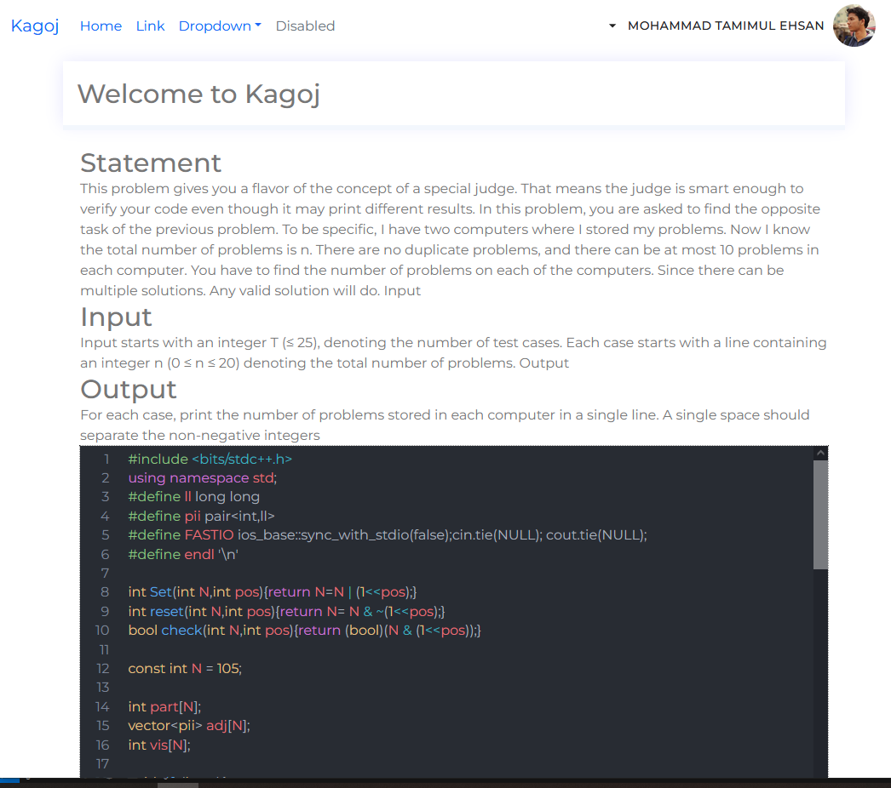
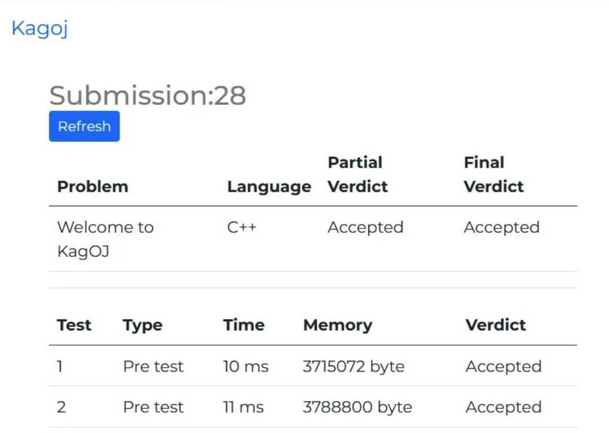

<!--  -->


<br>
Kagoj is an online judge platform specialized to host lab test and evaluation of CSE, BUET. Automated code compilation, validation and evaluation is aimed to provide efficiency to both the teachers and students.

PS: for initial version of the project please refer to [Kagoj-Old](https://github.com/TamimEhsan/KagOJ-Old)

## Project Details
### Code editor
KagOJ has an code editor where students can directly code into and test their code. 

### Code compilation and execution
Code compilation and execution is done in a sandboxed environment to ensure safety of host machine. Currently it only supports C and C++ as the supported language. And the verdicts supported are `Accepted`, `Wrong Answer`, `Time Limit Exceeded`, `Memory Limit Exceeded`, `Runtime Error` and `Compilation Error`.

### Grading
The system grades the submission based on the number of test cases passed. The evalutors can also alternate the marking based on their preferences.

### Site management
Teachers can create courses and add students to those courses. Teachers can also add problems to the courses for exam or for practice

### Problem Generation and Test Cases
Teachers can add new problems and add test cases for them. The test cases can be marked as sample or hidden for evaluation.

### Exam
Teachers can create a exam under a course with deadline. The students can edit, submit and see the verdict of their code untill that deadline. After that no one can modify or resubmit any solution.


## How to start

#### Installation

At first clone this repository by

`git clone https://github.com/TamimEhsan/KagOJ.git`
The backend only runs in linux environment. So either open with ubuntu, or if you are in windows use wsl

#### Start Backend

Then go into `Kagoj/Kagoj Backend`

create a `.env` file. And populate with the followings

```
PORT=3005
DATABASE_URL=DATABASE_URL
DATABASE_URL_LOCAL=DATABASE_URL_LOCAL
JWT_SECRET=JWT_SECRET
OS_PASS=OS_PASS
```

and install dependencies and then start node server

```
npm i
npm run dev
```

#### Start Frontend

Then go into `Kagoj/Kagoj Frontend`

and install dependencies and then start node server.

```
npm i --force
npm start
```

### Demo




### Collaborators
- [Mehbubul Hasan Al Quvi](https://github.com/quvi007)
- [Kazi Rakibul Hasan](https://github.com/rakiiiib)